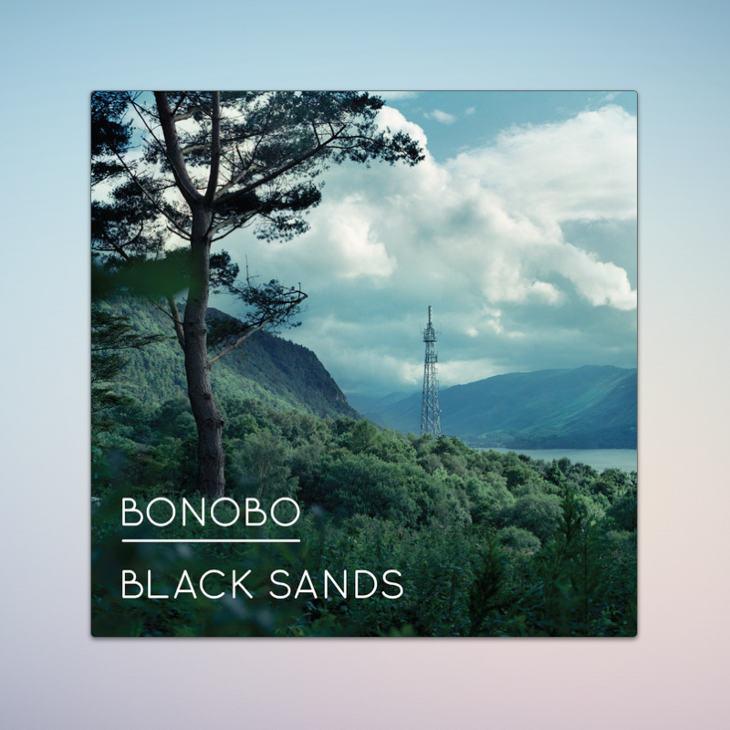
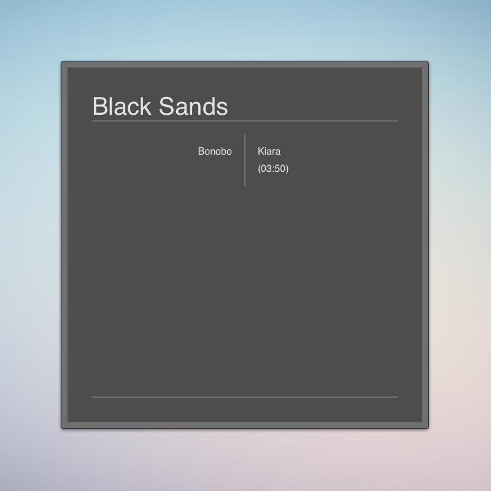

# Big Vinyl Cover

A theme for [Bowtie](http://bowtieapp.com/) with a big 600px cover and CSS flip animation. The theme has a backside that can be flipped by double-clicking on the cover. On the backside it shows the album, the artist, the song and the length of the song.
 
## Preview

**Front**

**Back**

## Installation

1. Download this repository as a zip archive and extract the downloaded archive.
2. Open the extracted folder and install the theme by double-clicking on the file `Big Vinyl Cover.bowtie`.

## License

This project is open source licensed under the BSD 3-Clause License. Please see the [LICENSE file](LICENSE.md) for more information.